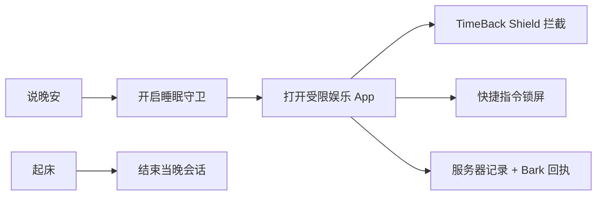

# 肥豹睡眠守卫

[](LICENSE)

把一句“晚安”变成真正会执行的 iPhone 睡眠守卫：说完晚安后，指定娱乐 App 会被 Shield 挡住；再次尝试打开时，自动锁屏、记录次数，并通过 Bark 留下一条无法假装没看见的回执。

它不是又一个可以随手划掉的睡前提醒。拦截由系统级 Shield 负责，快捷指令只上报事件和锁屏，服务器保存当晚状态与证据，Bark 负责告诉你：“抓到了。”

这是部署给小肥豹自己的私人版本：保留可靠的拦截与留证逻辑，通知称呼、工具说明和授权界面都已换成我们自己的。

## 它解决什么

普通的睡眠通知只增加一条通知；肥豹睡眠守卫 把“已经决定睡觉”变成一个有开始、有执行、有结束的状态：



- 正常状态下不锁屏、不发送“偷开”通知；
- 晚安后开启睡眠会话；默认在上海时间下一次上午 8:00 自动过期；
- 即使没有说晚安，上海时间凌晨 0:00 至上午 8:00 再打开受限娱乐 App，也会自动开启守卫并立即锁屏；
- 每次打开选中的娱乐 App 都会被 Shield 挡住并触发锁屏；
- 第一次、第二次和第三次以后使用不同强度的 Bark 文案；
- 重复说晚安不会洗掉当晚已经留下的次数；
- 起床后结束会话，娱乐 App 恢复正常；
- 可选连接 ChatGPT MCP，在使用者明确说晚安时自动开启同一套守卫。

## 当前可用方案

当前方案已经可以在 iPhone 上完整工作：

| 组件 | 职责 |
| --- | --- |
| TimeBack: Take Back Your Time | 提供 iOS 系统 Shield，真正挡住指定 App |
| [iPhone 快捷指令](v0.2-shortcuts/INSTALL.md) | 发送晚安、App 打开和起床事件，并在偷开时锁屏 |
| [Netlify 事件服务](netlify/README.md) | 保存睡眠状态与次数，先记录证据再发送 Bark |
| ChatGPT MCP（可选） | 让对话中的“晚安”直接开启守卫，首次连接需在 Bark 中确认授权 |

Bark 只负责回执与追责，不承担拦截。真正挡住 App 的是 TimeBack Shield；即使 Bark 推送失败，服务器中已经写入的事件也不会消失。

## 快速开始

1. 部署并配置 [Netlify 事件服务](netlify/README.md)。
2. 在 TimeBack 中创建并启用一条名为 `肥豹睡眠守卫` 的规则，选择需要拦截的娱乐 App。
3. 按 [快捷指令安装说明](v0.2-shortcuts/INSTALL.md) 创建晚安、偷开和起床三个事件。
4. 先只用一个 App 完成开启、连续偷开三次、结束会话的验收，再扩大 App 范围。
5. 如需由 ChatGPT 接管晚安触发，将 `https://<site>.netlify.app/mcp` 连接为 MCP，并从 Bark 点按一次授权链接。

不要把电话、信息、地图、支付、医疗或其他紧急 App 加入拦截列表。

## 服务器规则

| 事件 | 行为 |
| --- | --- |
| `sleep_guard_started` | 开启当晚会话并把次数归零；重复开启不会清除已有记录 |
| `blocked_app_opened` | 会话有效时递增次数；会话未开启但处于凌晨 0:00 至上午 8:00 时自动开启并计为第一次；其他时间返回 `inactive` |
| `sleep_guard_ended` | 结束会话；之后打开 App 不会触发偷开 Bark |

TimeBack 从第一次打开受限 App 开始就保持 Shield。次数只改变 Bark 文案和留下的记录，不代表使用者拥有一次访问内容的机会。

## 个性化

当前私人版本已经完成这些个性化：

- iPhone 晚安快捷指令名为「小肥晚安」；
- Bark 使用「老公 / 小肥豹」称呼，不再使用上游示例头像兜底；
- ChatGPT 中显示「肥豹睡眠守卫」，并提供开启与只读查询两个工具；
- 被拦截的 App、TimeBack 日程、起床时间和通知文案仍可继续调整。

## 仓库结构

```text
v0.2-shortcuts/  iPhone 快捷指令与自动化配置说明
netlify/         事件 API、Netlify Blobs、Bark 与 OAuth MCP
ios/             FamilyControls / ManagedSettings 原生 Shield 脚手架
scripts/         自动验证与头像构建脚本
```

## 原生 Shield 版本

`ios/` 包含使用 `FamilyControls`、`ManagedSettings`、`ManagedSettingsUI` 和 `DeviceActivity` 的原生工程脚手架。源码已经生成，但当前只在 Windows 上做过静态验证，尚未完成 Xcode 编译、Apple 签名、Family Controls entitlement 审批或真机 Shield 验收。

因此，当前推荐使用 TimeBack + 快捷指令版本。将来自定义原生 Shield 仍需要 macOS、Xcode 和 Apple 开发者签名；详见 [iOS 安装说明](ios/INSTALL.md)。

## 验证

需要 Node.js 22 或更新版本。在仓库根目录运行：

```bash
npm run verify
```

验证覆盖事件校验、会话开始与结束、重复开启、过期状态、三档偷开次数、并发写入、Bark 失败留证、OAuth 2.1 PKCE、一次性授权码、MCP 鉴权与工具调用。

原生 iOS 部分的通过仅代表源码结构和配置文件通过静态检查，不等同于真机可用。

## 隐私与安全边界

- `BARK_DEVICE_KEY` 只放在 Netlify 环境变量中，绝不进入快捷指令、Swift 源码或 GitHub；
- `SLEEP_GUARD_SHORTCUT_TOKEN` 只存在于 Netlify 和使用者自己的 iPhone 请求头中；
- ChatGPT MCP 使用独立 OAuth 访问令牌，不接受也不返回快捷指令 Token；
- 所有偷开事件先写入 Netlify Blobs，再尝试发送 Bark；
- `.env`、Netlify 本地状态、依赖目录和生成物默认被 Git 忽略；
- 手机所有者最终仍能关闭自动化、撤销屏幕使用时间权限或删除拦截 App。这个项目增加继续刷手机的阻力与可见成本，但不声称提供无法撤销的绝对控制。

## License

本私人版本沿用上游项目的 [MIT](LICENSE) 许可；原始版权声明保留在许可证文件中。
